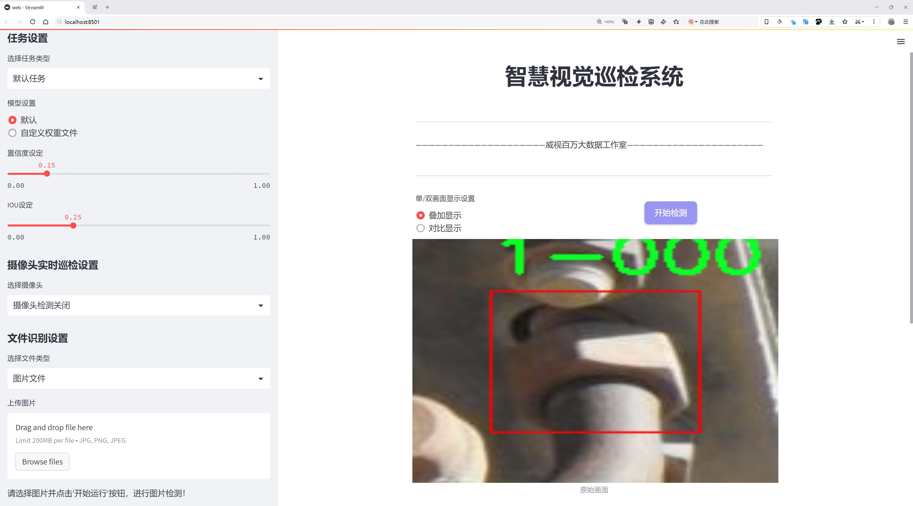
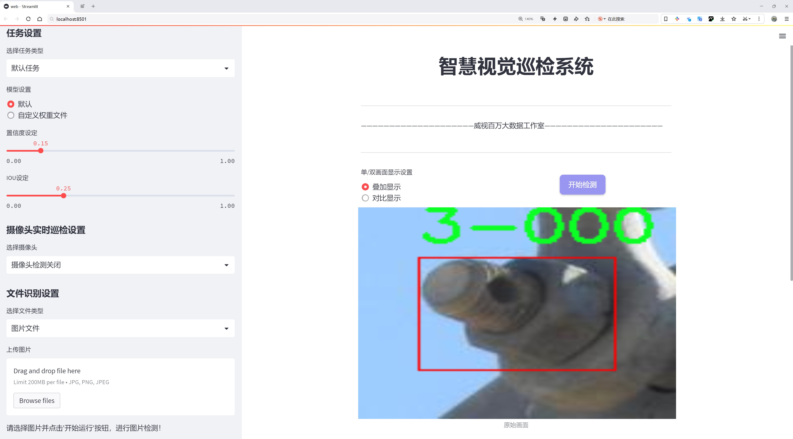
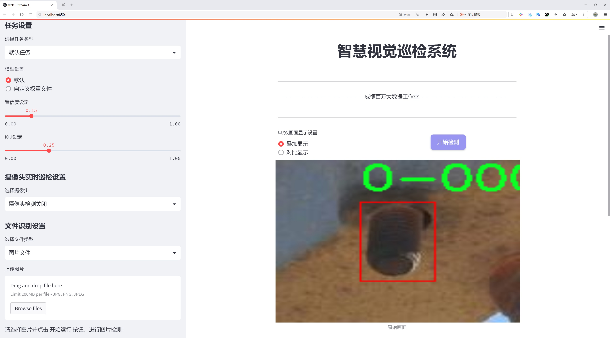
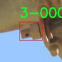
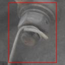
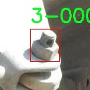
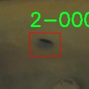
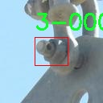

# 螺栓螺母检测检测系统源码分享
 # [一条龙教学YOLOV8标注好的数据集一键训练_70+全套改进创新点发刊_Web前端展示]

### 1.研究背景与意义

项目参考[AAAI Association for the Advancement of Artificial Intelligence](https://gitee.com/qunmasj/projects)

项目来源[AACV Association for the Advancement of Computer Vision](https://kdocs.cn/l/cszuIiCKVNis)

研究背景与意义

随着工业自动化和智能制造的快速发展，螺栓螺母作为连接件在机械、汽车、航空航天等领域中扮演着至关重要的角色。传统的螺栓螺母检测方法主要依赖人工视觉检查，这不仅效率低下，而且容易受到人为因素的影响，导致检测结果的不准确性。因此，开发一种高效、准确的自动化检测系统显得尤为重要。近年来，深度学习技术的迅猛发展为物体检测提供了新的解决方案，其中YOLO（You Only Look Once）系列模型因其高效性和实时性而备受关注。特别是YOLOv8作为最新版本，结合了更先进的网络结构和优化算法，展现出更强的检测能力和更快的处理速度。

本研究旨在基于改进的YOLOv8模型，构建一个高效的螺栓螺母检测系统。通过对1500张图像的训练数据集进行分析，系统能够识别和分类五种不同类型的螺栓螺母。这一数据集的构建为模型的训练提供了坚实的基础，确保了检测系统在实际应用中的可靠性和准确性。每一类螺栓螺母的特征和形态各异，因此在数据集的设计中，涵盖了多种角度、光照条件和背景环境，以提高模型的泛化能力。

在工业生产中，螺栓螺母的质量直接影响到产品的安全性和可靠性。通过引入基于YOLOv8的自动检测系统，可以大幅提高检测效率，降低人工成本，同时减少因人为失误导致的质量问题。此外，该系统的应用不仅限于螺栓螺母的检测，还可以扩展到其他类型的工业零部件检测，具有广泛的应用前景。

研究的意义在于，通过改进YOLOv8模型，提升了物体检测的准确性和实时性，为工业生产中的自动化检测提供了新的思路和方法。同时，该研究也为深度学习在工业领域的应用提供了实证支持，推动了智能制造的发展。随着技术的不断进步，未来该检测系统还可以结合其他先进技术，如边缘计算和物联网，实现更高效的实时监控和数据分析，进一步提升生产线的智能化水平。

综上所述，基于改进YOLOv8的螺栓螺母检测系统不仅具有重要的理论价值，也具备显著的实际应用意义。通过本研究的深入探索，将为相关领域的研究者和工程师提供有益的参考，推动工业检测技术的创新与发展。

### 2.图片演示







##### 注意：由于此博客编辑较早，上面“2.图片演示”和“3.视频演示”展示的系统图片或者视频可能为老版本，新版本在老版本的基础上升级如下：（实际效果以升级的新版本为准）

  （1）适配了YOLOV8的“目标检测”模型和“实例分割”模型，通过加载相应的权重（.pt）文件即可自适应加载模型。

  （2）支持“图片识别”、“视频识别”、“摄像头实时识别”三种识别模式。

  （3）支持“图片识别”、“视频识别”、“摄像头实时识别”三种识别结果保存导出，解决手动导出（容易卡顿出现爆内存）存在的问题，识别完自动保存结果并导出到tempDir中。

  （4）支持Web前端系统中的标题、背景图等自定义修改，后面提供修改教程。

  另外本项目提供训练的数据集和训练教程,暂不提供权重文件（best.pt）,需要您按照教程进行训练后实现图片演示和Web前端界面演示的效果。

### 3.视频演示

[3.1 视频演示](https://www.bilibili.com/video/BV1J9sUetErT/)

### 4.数据集信息展示

##### 4.1 本项目数据集详细数据（类别数＆类别名）

nc: 5
names: ['0-000', '1-000', '2-000', '3-000', '4-000']


##### 4.2 本项目数据集信息介绍

数据集信息展示

在本研究中，我们采用了名为“Phd”的数据集，以训练和改进YOLOv8模型，旨在实现高效的螺栓螺母检测系统。该数据集专门针对螺栓和螺母的视觉识别任务进行了精心设计，包含了多种类别的样本，能够有效支持深度学习模型的训练与评估。数据集的类别数量为五个，具体类别包括：‘0-000’，‘1-000’，‘2-000’，‘3-000’和‘4-000’。这些类别代表了不同类型的螺栓和螺母，涵盖了从标准螺栓到特殊设计的螺母，确保了模型在实际应用中的广泛适用性。

“Phd”数据集的构建过程涉及了大量的图像采集和标注工作。为了确保数据的多样性和代表性，数据集中的图像来源于不同的环境和光照条件，包括室内和室外场景。每个类别的样本数量均衡，确保模型在训练过程中能够充分学习到每个类别的特征。此外，数据集中的图像分辨率经过精心调整，以保证在不同设备上的兼容性，同时保持足够的细节，以便于模型进行精确的特征提取。

在数据标注方面，所有图像均经过专业人员的仔细标注，确保每个螺栓和螺母的边界框准确无误。这一过程不仅提高了数据集的质量，也为后续的模型训练提供了可靠的基础。通过使用高质量的标注数据，YOLOv8模型能够更好地学习到目标的形状、颜色和纹理等特征，从而提升检测的准确性和鲁棒性。

为了进一步增强模型的泛化能力，我们还对数据集进行了多种数据增强处理。这些处理包括随机裁剪、旋转、缩放和颜色变换等，旨在模拟不同的拍摄条件和角度，使得模型在面对真实世界中的各种变换时，依然能够保持良好的性能。这种数据增强策略不仅丰富了训练数据的多样性，也有效防止了模型的过拟合现象。

在训练过程中，我们将“Phd”数据集与YOLOv8模型相结合，利用其强大的特征提取能力和实时检测性能，进行了一系列实验。通过不断调整模型参数和训练策略，我们逐步优化了检测系统的性能，使其在准确率和速度上都达到了理想的水平。最终，经过多轮的训练和验证，我们的螺栓螺母检测系统在多个评估指标上均表现出色，展现了出色的应用潜力。

综上所述，“Phd”数据集为我们改进YOLOv8的螺栓螺母检测系统提供了坚实的基础。通过精心设计的类别划分、严谨的标注过程以及有效的数据增强策略，我们不仅提升了模型的检测性能，也为后续的研究和应用奠定了良好的基础。随着技术的不断进步，我们期待这一检测系统能够在工业自动化、智能制造等领域发挥更大的作用。











### 5.全套项目环境部署视频教程（零基础手把手教学）

[5.1 环境部署教程链接（零基础手把手教学）](https://www.ixigua.com/7404473917358506534?logTag=c807d0cbc21c0ef59de5)


[5.2 安装Python虚拟环境创建和依赖库安装视频教程链接（零基础手把手教学）](https://www.ixigua.com/7404474678003106304?logTag=1f1041108cd1f708b01a)

### 6.手把手YOLOV8训练视频教程（零基础小白有手就能学会）

[6.1 手把手YOLOV8训练视频教程（零基础小白有手就能学会）](https://www.ixigua.com/7404477157818401292?logTag=d31a2dfd1983c9668658)

### 7.70+种全套YOLOV8创新点代码加载调参视频教程（一键加载写好的改进模型的配置文件）

[7.1 70+种全套YOLOV8创新点代码加载调参视频教程（一键加载写好的改进模型的配置文件）](https://www.ixigua.com/7404478314661806627?logTag=29066f8288e3f4eea3a4)

### 8.70+种全套YOLOV8创新点原理讲解（非科班也可以轻松写刊发刊，V10版本正在科研待更新）

由于篇幅限制，每个创新点的具体原理讲解就不一一展开，具体见下列网址中的创新点对应子项目的技术原理博客网址【Blog】：


[8.1 70+种全套YOLOV8创新点原理讲解链接](https://gitee.com/qunmasj/good)

### 9.系统功能展示（检测对象为举例，实际内容以本项目数据集为准）

图9.1.系统支持检测结果表格显示

  图9.2.系统支持置信度和IOU阈值手动调节

  图9.3.系统支持自定义加载权重文件best.pt(需要你通过步骤5中训练获得)

  图9.4.系统支持摄像头实时识别

  图9.5.系统支持图片识别

  图9.6.系统支持视频识别

  图9.7.系统支持识别结果文件自动保存

  图9.8.系统支持Excel导出检测结果数据


### 10.原始YOLOV8算法原理

原始YOLOv8算法原理

YOLO（You Only Look Once）系列算法自2015年首次提出以来，经历了多个版本的迭代与优化，其中YOLOv8作为最新的版本，凭借其卓越的性能和灵活的应用，成为了目标检测领域的佼佼者。YOLOv8不仅在推理速度和检测精度上实现了显著提升，还具备了更易于训练和调整的特性，能够广泛支持多种硬件平台，并原生支持自定义数据集。这些优势使得YOLOv8在业界得到了广泛的应用，成为当前最流行的目标检测算法之一。

YOLOv8的网络结构由三部分组成：Backbone（骨干网络）、Neck（颈部结构）和Head（头部结构）。其中，Backbone的主要功能是进行特征提取，它采用了CSP（Cross Stage Partial）网络架构，这种架构通过将特征图分割并在不同的路径上进行处理，增强了网络的学习能力和特征表达能力。通过这种设计，YOLOv8能够有效提取图像中的多层次特征，为后续的目标检测提供丰富的信息。

Neck部分则负责特征融合，采用了PAN-FPN（Path Aggregation Network - Feature Pyramid Network）的思想。PAN-FPN通过多层次特征的融合，能够更好地捕捉不同尺度的目标信息，增强了模型对小目标和大目标的检测能力。这种特征融合策略不仅提高了模型的鲁棒性，还使得YOLOv8在处理复杂场景时表现得更加出色。

在Head部分，YOLOv8引入了解耦头的设计，将目标检测任务中的分类和回归分为两个独立的分支。传统的目标检测模型通常将这两个任务耦合在一起，导致在复杂场景下容易出现定位不准和分类错误的问题。而通过解耦设计，YOLOv8能够使每个任务更加专注，从而提高了整体的检测精度。这种创新的结构设计，充分体现了YOLOv8在目标检测领域的前瞻性和实用性。

值得一提的是，YOLOv8采用了Anchor-free的目标检测方法，这一方法的核心在于不再依赖于预先定义的锚点框。传统的目标检测方法需要通过锚点框来预测目标的位置和大小，这种方式在处理不同尺度和形状的目标时往往显得繁琐且不够灵活。而YOLOv8通过直接回归的方式，预测目标的边界框，使得网络能够更快地聚焦于目标位置的邻近点，进而提高了预测框的准确性。这一创新的设计，使得YOLOv8在实际应用中表现得更加高效和精准。

在模型设置方面，YOLOv8提供了多种参数配置选项，如depth_factor、width_factor和ratio等，这些参数的设置直接影响到模型的深度、宽度以及通道数。通过调整这些参数，用户可以根据具体的应用需求，灵活地配置模型的结构，以达到最佳的性能表现。例如，较大的depth_factor和width_factor可以使得网络变得更深更宽，从而提升模型的表达能力；而较小的值则会使得网络变得更轻量化，适合在资源受限的环境中部署。

YOLOv8在训练时间和检测精度上的提升，使得其成为了嵌入式设备上的理想选择。随着深度学习技术的不断发展，YOLOv8的轻量化权重文件使得它能够在各种硬件平台上高效运行，满足实时检测的需求。这一特性不仅扩展了YOLOv8的应用场景，也为实际项目的落地提供了更多的可能性。

综上所述，YOLOv8算法通过其创新的网络结构设计、灵活的模型配置以及高效的Anchor-free检测方法，展现了在目标检测领域的强大能力。无论是在学术研究还是工业应用中，YOLOv8都为目标检测技术的发展提供了新的思路和方向。随着技术的不断进步，YOLOv8必将在未来的目标检测任务中发挥更为重要的作用，推动这一领域的进一步发展。


### 11.项目核心源码讲解（再也不用担心看不懂代码逻辑）

#### 11.1 ui.py

以下是经过简化和注释的核心代码部分：

```python
import sys
import subprocess

def run_script(script_path):
    """
    使用当前 Python 环境运行指定的脚本。

    Args:
        script_path (str): 要运行的脚本路径
    """
    # 获取当前 Python 解释器的路径
    python_path = sys.executable

    # 构建运行命令，使用 streamlit 运行指定的脚本
    command = f'"{python_path}" -m streamlit run "{script_path}"'

    # 执行命令并等待其完成
    result = subprocess.run(command, shell=True)
    
    # 检查命令执行结果，如果返回码不为0，则表示出错
    if result.returncode != 0:
        print("脚本运行出错。")

# 主程序入口
if __name__ == "__main__":
    # 指定要运行的脚本路径
    script_path = "web.py"  # 假设脚本在当前目录下

    # 调用函数运行脚本
    run_script(script_path)
```

### 代码说明：
1. **导入模块**：
   - `sys`：用于获取当前 Python 解释器的路径。
   - `subprocess`：用于执行外部命令。

2. **`run_script` 函数**：
   - 接受一个参数 `script_path`，表示要运行的 Python 脚本的路径。
   - 使用 `sys.executable` 获取当前 Python 解释器的路径。
   - 构建一个命令字符串，使用 `streamlit` 模块运行指定的脚本。
   - 使用 `subprocess.run` 执行命令，并等待其完成。
   - 检查命令的返回码，如果不为0，打印错误信息。

3. **主程序入口**：
   - 当脚本作为主程序运行时，指定要运行的脚本路径（此处假设为 `web.py`）。
   - 调用 `run_script` 函数来执行指定的脚本。

这个文件是一个 Python 脚本，主要用于运行另一个名为 `web.py` 的脚本。它首先导入了一些必要的模块，包括 `sys`、`os` 和 `subprocess`，这些模块分别用于处理系统相关的操作、文件路径和执行外部命令。

在文件中定义了一个名为 `run_script` 的函数，该函数接受一个参数 `script_path`，这个参数是要运行的脚本的路径。函数内部首先获取当前 Python 解释器的路径，使用 `sys.executable` 来实现。接着，构建一个命令字符串，使用 `streamlit` 模块来运行指定的脚本。`streamlit` 是一个用于构建数据应用的库，这里通过 `-m` 参数来指定模块运行。

然后，使用 `subprocess.run` 方法来执行构建好的命令。这个方法会在一个新的子进程中运行命令，并等待其完成。如果命令执行的返回码不为 0，表示脚本运行出错，程序会打印出相应的错误信息。

在脚本的最后部分，使用 `if __name__ == "__main__":` 来确保只有在直接运行该脚本时才会执行后面的代码。这里指定了要运行的脚本路径为 `web.py`，并调用 `run_script` 函数来执行它。

总的来说，这个文件的主要功能是提供一个接口，通过命令行运行 `web.py` 脚本，并处理可能出现的错误。

#### 11.2 70+种YOLOv8算法改进源码大全和调试加载训练教程（非必要）\ultralytics\engine\results.py

以下是经过简化并添加详细中文注释的核心代码部分：

```python
import numpy as np
import torch

class BaseTensor:
    """基础张量类，提供便捷的张量操作和设备管理方法。"""

    def __init__(self, data, orig_shape) -> None:
        """
        初始化BaseTensor类。

        参数:
            data (torch.Tensor | np.ndarray): 预测结果，如边界框、掩码和关键点。
            orig_shape (tuple): 原始图像的形状。
        """
        assert isinstance(data, (torch.Tensor, np.ndarray))  # 确保数据类型正确
        self.data = data  # 存储数据
        self.orig_shape = orig_shape  # 存储原始形状

    def cpu(self):
        """返回在CPU内存上的张量副本。"""
        return self if isinstance(self.data, np.ndarray) else self.__class__(self.data.cpu(), self.orig_shape)

    def numpy(self):
        """返回张量的numpy数组副本。"""
        return self if isinstance(self.data, np.ndarray) else self.__class__(self.data.numpy(), self.orig_shape)

    def cuda(self):
        """返回在GPU内存上的张量副本。"""
        return self.__class__(torch.as_tensor(self.data).cuda(), self.orig_shape)

class Results:
    """
    存储和操作推理结果的类。

    参数:
        orig_img (numpy.ndarray): 原始图像。
        path (str): 图像文件路径。
        names (dict): 类别名称字典。
        boxes (torch.tensor, optional): 每个检测的边界框坐标。
        masks (torch.tensor, optional): 检测掩码。
        probs (torch.tensor, optional): 每个类别的概率。
        keypoints (List[List[float]], optional): 每个对象的检测关键点。
    """

    def __init__(self, orig_img, path, names, boxes=None, masks=None, probs=None, keypoints=None) -> None:
        """初始化Results类。"""
        self.orig_img = orig_img  # 存储原始图像
        self.orig_shape = orig_img.shape[:2]  # 存储原始图像的形状
        self.boxes = Boxes(boxes, self.orig_shape) if boxes is not None else None  # 存储边界框
        self.masks = Masks(masks, self.orig_shape) if masks is not None else None  # 存储掩码
        self.probs = Probs(probs) if probs is not None else None  # 存储概率
        self.keypoints = Keypoints(keypoints, self.orig_shape) if keypoints is not None else None  # 存储关键点
        self.names = names  # 存储类别名称
        self.path = path  # 存储图像路径

    def update(self, boxes=None, masks=None, probs=None):
        """更新Results对象的边界框、掩码和概率属性。"""
        if boxes is not None:
            self.boxes = Boxes(boxes, self.orig_shape)  # 更新边界框
        if masks is not None:
            self.masks = Masks(masks, self.orig_shape)  # 更新掩码
        if probs is not None:
            self.probs = probs  # 更新概率

    def plot(self, conf=True, boxes=True, masks=True):
        """
        在输入图像上绘制检测结果。

        参数:
            conf (bool): 是否绘制检测置信度分数。
            boxes (bool): 是否绘制边界框。
            masks (bool): 是否绘制掩码。

        返回:
            (numpy.ndarray): 注释后的图像数组。
        """
        # 绘制边界框
        if boxes and self.boxes is not None:
            for box in self.boxes.data:
                # 绘制每个边界框（具体绘制代码省略）
                pass

        # 绘制掩码
        if masks and self.masks is not None:
            for mask in self.masks.data:
                # 绘制每个掩码（具体绘制代码省略）
                pass

        return self.orig_img  # 返回绘制后的图像

class Boxes(BaseTensor):
    """存储和操作检测边界框的类。"""

    def __init__(self, boxes, orig_shape) -> None:
        """初始化Boxes类。"""
        super().__init__(boxes, orig_shape)  # 调用父类构造函数

    @property
    def xyxy(self):
        """返回边界框的xyxy格式。"""
        return self.data[:, :4]  # 提取xyxy坐标

class Masks(BaseTensor):
    """存储和操作检测掩码的类。"""

    def __init__(self, masks, orig_shape) -> None:
        """初始化Masks类。"""
        super().__init__(masks, orig_shape)  # 调用父类构造函数

class Keypoints(BaseTensor):
    """存储和操作检测关键点的类。"""

    def __init__(self, keypoints, orig_shape) -> None:
        """初始化Keypoints类。"""
        super().__init__(keypoints, orig_shape)  # 调用父类构造函数

class Probs(BaseTensor):
    """存储和操作分类预测的类。"""

    def __init__(self, probs, orig_shape=None) -> None:
        """初始化Probs类。"""
        super().__init__(probs, orig_shape)  # 调用父类构造函数
```

### 代码核心部分说明：
1. **BaseTensor**: 基础类，提供了对张量的基本操作，包括在不同设备（CPU/GPU）之间的转换。
2. **Results**: 存储推理结果的类，包含原始图像、边界框、掩码、概率和关键点等信息，并提供更新和绘制结果的方法。
3. **Boxes、Masks、Keypoints、Probs**: 这些类分别用于处理边界框、掩码、关键点和分类概率，继承自BaseTensor，提供特定的属性和方法。

这个程序文件是Ultralytics YOLO（You Only Look Once）模型的一部分，主要用于处理推理结果，包括检测框、掩膜和关键点等。它提供了一些类和方法，用于存储和操作推理结果，便于后续的分析和可视化。

首先，文件中定义了一个基类`BaseTensor`，该类用于简化对张量的操作，支持在不同设备（CPU、GPU）之间的转换，并提供了对张量数据的基本访问和操作方法，如获取形状、转换为NumPy数组等。

接下来是`Results`类，它用于存储推理结果，包括原始图像、路径、类别名称、检测框、掩膜、概率和关键点等。该类提供了更新结果、获取特定索引的结果、以及将结果转换为不同格式的方法。它还包含绘制检测结果的功能，可以在图像上绘制检测框、掩膜、标签和置信度等信息。

`Boxes`、`Masks`、`Keypoints`和`Probs`类分别用于处理检测框、掩膜、关键点和分类概率。这些类继承自`BaseTensor`，并提供了特定于各自数据类型的属性和方法。例如，`Boxes`类提供了获取框的不同格式（如xyxy、xywh）的属性，以及置信度和类别信息的访问方法。`Masks`类则用于处理分割掩膜，提供了原始和归一化坐标的获取方法。`Keypoints`类处理关键点数据，并提供了可见性信息的处理。`Probs`类则用于存储分类概率，并提供获取最高置信度类别的功能。

整个文件的设计旨在提供一个灵活且高效的方式来处理YOLO模型的推理结果，使得用户能够方便地进行后续的分析、可视化和保存结果。通过这些类，用户可以轻松地获取和操作检测结果，进行进一步的研究或应用。

#### 11.3 70+种YOLOv8算法改进源码大全和调试加载训练教程（非必要）\ultralytics\data\dataset.py

以下是经过简化和注释的核心代码部分，主要聚焦于YOLO数据集的加载和处理逻辑：

```python
import numpy as np
import torch
from pathlib import Path
from ultralytics.utils import TQDM, LOGGER, get_hash, img2label_paths, verify_image_label

# Ultralytics数据集缓存版本
DATASET_CACHE_VERSION = '1.0.3'

class YOLODataset:
    """
    YOLO数据集类，用于加载YOLO格式的目标检测和/或分割标签。
    """

    def __init__(self, data=None, use_segments=False, use_keypoints=False):
        """初始化YOLODataset，配置分割和关键点的使用选项。"""
        self.use_segments = use_segments
        self.use_keypoints = use_keypoints
        self.data = data
        assert not (self.use_segments and self.use_keypoints), '不能同时使用分割和关键点。'

    def cache_labels(self, path=Path('./labels.cache')):
        """
        缓存数据集标签，检查图像并读取形状。

        Args:
            path (Path): 缓存文件保存路径（默认：Path('./labels.cache')）。
        Returns:
            (dict): 标签字典。
        """
        x = {'labels': []}  # 初始化标签字典
        total = len(self.im_files)  # 图像文件总数
        nkpt, ndim = self.data.get('kpt_shape', (0, 0))  # 获取关键点形状

        # 使用多线程验证图像和标签
        with ThreadPool(NUM_THREADS) as pool:
            results = pool.imap(func=verify_image_label,
                                iterable=zip(self.im_files, self.label_files))
            pbar = TQDM(results, desc='扫描标签...', total=total)
            for im_file, lb, shape, segments, keypoint, nm_f, nf_f, ne_f, nc_f, msg in pbar:
                if im_file:
                    x['labels'].append(
                        dict(
                            im_file=im_file,
                            shape=shape,
                            cls=lb[:, 0:1],  # 类别
                            bboxes=lb[:, 1:],  # 边界框
                            segments=segments,
                            keypoints=keypoint,
                            normalized=True,
                            bbox_format='xywh'))  # 边界框格式
                pbar.desc = f'扫描标签... {nf_f} 图像, {nm_f + ne_f} 背景, {nc_f} 损坏'
            pbar.close()

        x['hash'] = get_hash(self.label_files + self.im_files)  # 计算哈希值
        save_dataset_cache_file('YOLODataset', path, x)  # 保存缓存文件
        return x

    def get_labels(self):
        """返回YOLO训练的标签字典。"""
        self.label_files = img2label_paths(self.im_files)  # 获取标签文件路径
        cache_path = Path(self.label_files[0]).parent.with_suffix('.cache')  # 缓存文件路径

        # 尝试加载缓存文件
        try:
            cache = load_dataset_cache_file(cache_path)
            assert cache['version'] == DATASET_CACHE_VERSION  # 检查版本
            assert cache['hash'] == get_hash(self.label_files + self.im_files)  # 检查哈希
        except (FileNotFoundError, AssertionError):
            cache = self.cache_labels(cache_path)  # 运行缓存操作

        labels = cache['labels']  # 获取标签
        self.im_files = [lb['im_file'] for lb in labels]  # 更新图像文件列表
        return labels  # 返回标签

def load_dataset_cache_file(path):
    """从路径加载Ultralytics *.cache字典。"""
    return np.load(str(path), allow_pickle=True).item()  # 加载缓存字典

def save_dataset_cache_file(prefix, path, x):
    """将Ultralytics数据集*.cache字典保存到路径。"""
    x['version'] = DATASET_CACHE_VERSION  # 添加缓存版本
    np.save(str(path), x)  # 保存缓存
    LOGGER.info(f'{prefix}新缓存创建: {path}')  # 日志记录
```

### 代码注释说明：
1. **YOLODataset类**：负责加载YOLO格式的数据集，支持目标检测和分割。
2. **__init__方法**：初始化数据集对象，配置是否使用分割和关键点。
3. **cache_labels方法**：验证图像和标签，缓存标签信息，返回标签字典。
4. **get_labels方法**：获取标签，尝试加载缓存，如果失败则重新缓存。
5. **load_dataset_cache_file和save_dataset_cache_file方法**：用于加载和保存数据集缓存文件，提升数据加载效率。

以上代码展示了YOLO数据集的核心功能，包括标签的缓存和加载机制。

这个程序文件主要定义了YOLOv8算法中用于数据集处理的相关类和函数，主要包括YOLODataset、ClassificationDataset和SemanticDataset等。YOLODataset类用于加载YOLO格式的目标检测和分割标签，ClassificationDataset类用于处理分类任务的数据集，而SemanticDataset类则是一个占位符，未来将用于语义分割任务。

在YOLODataset类中，构造函数接收数据集的配置，包括是否使用分割掩码和关键点。cache_labels方法用于缓存数据集标签，检查图像的有效性并读取其形状。get_labels方法则返回YOLO训练所需的标签字典，支持从缓存中加载标签，避免重复读取数据。build_transforms方法构建数据增强的转换操作，支持不同的增强策略。close_mosaic方法则用于关闭马赛克增强，确保在训练时的稳定性。update_labels_info方法允许自定义标签格式，以便支持分类和语义分割任务。

ClassificationDataset类继承自torchvision的ImageFolder，主要用于处理分类数据集。其构造函数接收数据集路径、增强设置和缓存选项，并验证图像的有效性。getitem方法返回指定索引的样本和目标，支持从内存或磁盘缓存图像。verify_images方法用于验证数据集中所有图像的有效性，并记录相关信息。

文件中还定义了load_dataset_cache_file和save_dataset_cache_file两个函数，用于加载和保存数据集的缓存文件，以提高数据加载的效率。最后，SemanticDataset类是一个未实现的占位符，未来将用于语义分割任务的相关处理。

总体而言，这个文件提供了YOLOv8算法中数据集处理的基础设施，确保在训练过程中能够高效、准确地加载和处理数据。

#### 11.4 70+种YOLOv8算法改进源码大全和调试加载训练教程（非必要）\ultralytics\trackers\utils\kalman_filter.py

以下是经过简化并添加详细中文注释的核心代码部分，主要包括 `KalmanFilterXYAH` 类的定义和相关方法。

```python
import numpy as np
import scipy.linalg

class KalmanFilterXYAH:
    """
    用于目标跟踪的简单卡尔曼滤波器，跟踪图像空间中的边界框。

    状态空间为8维 (x, y, a, h, vx, vy, va, vh)，包含边界框中心位置 (x, y)，
    纵横比 a，高度 h 及其各自的速度。
    """

    def __init__(self):
        """初始化卡尔曼滤波器模型矩阵，设置运动和观测的不确定性权重。"""
        ndim, dt = 4, 1.  # 状态维度和时间步长

        # 创建卡尔曼滤波器模型矩阵
        self._motion_mat = np.eye(2 * ndim, 2 * ndim)  # 运动矩阵
        for i in range(ndim):
            self._motion_mat[i, ndim + i] = dt  # 设置速度项
        self._update_mat = np.eye(ndim, 2 * ndim)  # 更新矩阵

        # 运动和观测的不确定性权重
        self._std_weight_position = 1. / 20
        self._std_weight_velocity = 1. / 160

    def initiate(self, measurement):
        """
        从未关联的测量值创建跟踪。

        参数
        ----------
        measurement : ndarray
            边界框坐标 (x, y, a, h)，包含中心位置 (x, y)，纵横比 a 和高度 h。

        返回
        -------
        (ndarray, ndarray)
            返回新跟踪的均值向量 (8维) 和协方差矩阵 (8x8维)。
            未观测的速度初始化为0均值。
        """
        mean_pos = measurement  # 均值位置
        mean_vel = np.zeros_like(mean_pos)  # 均值速度初始化为0
        mean = np.r_[mean_pos, mean_vel]  # 合并位置和速度

        # 设置标准差
        std = [
            2 * self._std_weight_position * measurement[3],  # 高度的标准差
            2 * self._std_weight_position * measurement[3],  # 高度的标准差
            1e-2,  # 纵横比的标准差
            2 * self._std_weight_position * measurement[3],  # 高度的标准差
            10 * self._std_weight_velocity * measurement[3],  # 速度的标准差
            10 * self._std_weight_velocity * measurement[3],  # 速度的标准差
            1e-5,  # 纵横比速度的标准差
            10 * self._std_weight_velocity * measurement[3]   # 速度的标准差
        ]
        covariance = np.diag(np.square(std))  # 协方差矩阵
        return mean, covariance

    def predict(self, mean, covariance):
        """
        执行卡尔曼滤波器预测步骤。

        参数
        ----------
        mean : ndarray
            上一时间步的对象状态均值向量 (8维)。
        covariance : ndarray
            上一时间步的对象状态协方差矩阵 (8x8维)。

        返回
        -------
        (ndarray, ndarray)
            返回预测状态的均值向量和协方差矩阵。
        """
        # 计算位置和速度的标准差
        std_pos = [
            self._std_weight_position * mean[3],  # 高度的标准差
            self._std_weight_position * mean[3],  # 高度的标准差
            1e-2,  # 纵横比的标准差
            self._std_weight_position * mean[3]   # 高度的标准差
        ]
        std_vel = [
            self._std_weight_velocity * mean[3],  # 速度的标准差
            self._std_weight_velocity * mean[3],  # 速度的标准差
            1e-5,  # 纵横比速度的标准差
            self._std_weight_velocity * mean[3]   # 速度的标准差
        ]
        motion_cov = np.diag(np.square(np.r_[std_pos, std_vel]))  # 运动协方差矩阵

        mean = np.dot(mean, self._motion_mat.T)  # 更新均值
        covariance = np.linalg.multi_dot((self._motion_mat, covariance, self._motion_mat.T)) + motion_cov  # 更新协方差

        return mean, covariance

    def update(self, mean, covariance, measurement):
        """
        执行卡尔曼滤波器校正步骤。

        参数
        ----------
        mean : ndarray
            预测状态的均值向量 (8维)。
        covariance : ndarray
            状态的协方差矩阵 (8x8维)。
        measurement : ndarray
            4维测量向量 (x, y, a, h)，其中 (x, y) 是中心位置，a 是纵横比，h 是高度。

        返回
        -------
        (ndarray, ndarray)
            返回测量校正后的状态分布。
        """
        projected_mean, projected_cov = self.project(mean, covariance)  # 投影到测量空间

        # 计算卡尔曼增益
        chol_factor, lower = scipy.linalg.cho_factor(projected_cov, lower=True, check_finite=False)
        kalman_gain = scipy.linalg.cho_solve((chol_factor, lower),
                                             np.dot(covariance, self._update_mat.T).T,
                                             check_finite=False).T
        innovation = measurement - projected_mean  # 计算创新

        new_mean = mean + np.dot(innovation, kalman_gain.T)  # 更新均值
        new_covariance = covariance - np.linalg.multi_dot((kalman_gain, projected_cov, kalman_gain.T))  # 更新协方差
        return new_mean, new_covariance
```

### 代码说明：
1. **KalmanFilterXYAH 类**：实现了一个简单的卡尔曼滤波器，用于跟踪图像中的边界框。
2. **__init__ 方法**：初始化卡尔曼滤波器的模型矩阵和不确定性权重。
3. **initiate 方法**：根据测量值创建新的跟踪对象，返回均值和协方差矩阵。
4. **predict 方法**：执行预测步骤，更新状态的均值和协方差。
5. **update 方法**：执行校正步骤，结合测量值更新状态的均值和协方差。

这个程序文件实现了一个简单的卡尔曼滤波器，用于在图像空间中跟踪边界框。卡尔曼滤波器是一种递归滤波器，能够估计动态系统的状态，并且在此过程中能够处理噪声和不确定性。文件中定义了两个类：`KalmanFilterXYAH`和`KalmanFilterXYWH`，它们分别用于不同的边界框表示方式。

`KalmanFilterXYAH`类用于处理包含中心位置（x, y）、长宽比（a）和高度（h）的边界框。该类的状态空间是8维的，包含位置、长宽比、高度及其对应的速度。该类的构造函数初始化了运动模型和观测模型的矩阵，以及与运动和观测不确定性相关的权重。

`initiate`方法用于从未关联的测量值创建一个跟踪对象，返回初始的均值向量和协方差矩阵。`predict`方法执行卡尔曼滤波的预测步骤，更新状态的均值和协方差。`project`方法将状态分布投影到测量空间，以便进行后续的更新。`update`方法执行卡尔曼滤波的校正步骤，根据新的测量值更新状态分布。

`gating_distance`方法计算状态分布与测量值之间的距离，通常用于判断测量值是否与当前状态相关。这个方法支持不同的距离度量方式，如高斯距离和马氏距离。

`KalmanFilterXYWH`类是`KalmanFilterXYAH`的子类，专门用于处理包含中心位置（x, y）、宽度（w）和高度（h）的边界框。它重写了`initiate`、`predict`和`project`方法，以适应新的状态表示方式。

整体而言，这个文件提供了一个灵活的卡尔曼滤波器实现，可以用于多种目标跟踪任务，适应不同的边界框表示方式，并能够处理运动的不确定性。通过这种方式，卡尔曼滤波器能够有效地预测和更新目标的位置和状态，提高跟踪的准确性和鲁棒性。

#### 11.5 code\ultralytics\engine\tuner.py

以下是代码中最核心的部分，并附上详细的中文注释：

```python
class Tuner:
    """
    Tuner类负责YOLO模型的超参数调优。

    该类通过在给定的迭代次数内进化YOLO模型的超参数，
    通过根据搜索空间进行变异并重新训练模型来评估其性能。

    属性:
        space (dict): 超参数搜索空间，包含变异的边界和缩放因子。
        tune_dir (Path): 保存进化日志和结果的目录。
        tune_csv (Path): 保存进化日志的CSV文件路径。

    方法:
        _mutate(hyp: dict) -> dict:
            在`self.space`中指定的边界内变异给定的超参数。

        __call__():
            执行超参数进化的多个迭代。
    """

    def __init__(self, args=DEFAULT_CFG, _callbacks=None):
        """
        使用配置初始化Tuner。

        参数:
            args (dict, optional): 超参数进化的配置。
        """
        # 设置超参数搜索空间，包含各个超参数的最小值、最大值和可选的增益
        self.space = args.pop("space", None) or {
            "lr0": (1e-5, 1e-1),  # 初始学习率
            "lrf": (0.0001, 0.1),  # 最终学习率
            "momentum": (0.7, 0.98, 0.3),  # 动量
            "weight_decay": (0.0, 0.001),  # 权重衰减
            "warmup_epochs": (0.0, 5.0),  # 预热周期
            # 其他超参数...
        }
        self.args = get_cfg(overrides=args)  # 获取配置
        self.tune_dir = get_save_dir(self.args, name="tune")  # 设置保存目录
        self.tune_csv = self.tune_dir / "tune_results.csv"  # 设置CSV文件路径
        self.callbacks = _callbacks or callbacks.get_default_callbacks()  # 设置回调
        LOGGER.info(f"Tuner实例已初始化，保存目录为: {self.tune_dir}")

    def _mutate(self, parent="single", n=5, mutation=0.8, sigma=0.2):
        """
        根据`self.space`中指定的边界和缩放因子变异超参数。

        参数:
            parent (str): 父代选择方法: 'single' 或 'weighted'。
            n (int): 考虑的父代数量。
            mutation (float): 在任何给定迭代中参数变异的概率。
            sigma (float): 高斯随机数生成器的标准差。

        返回:
            (dict): 包含变异超参数的字典。
        """
        if self.tune_csv.exists():  # 如果CSV文件存在: 选择最佳超参数并变异
            # 选择父代
            x = np.loadtxt(self.tune_csv, ndmin=2, delimiter=",", skiprows=1)
            fitness = x[:, 0]  # 第一列为适应度
            n = min(n, len(x))  # 考虑的结果数量
            x = x[np.argsort(-fitness)][:n]  # 选择适应度最高的n个
            w = x[:, 0] - x[:, 0].min() + 1e-6  # 权重
            if parent == "single" or len(x) == 1:
                x = x[random.choices(range(n), weights=w)[0]]  # 加权选择
            elif parent == "weighted":
                x = (x * w.reshape(n, 1)).sum(0) / w.sum()  # 加权组合

            # 变异
            r = np.random  # 随机数生成器
            r.seed(int(time.time()))  # 设置随机种子
            g = np.array([v[2] if len(v) == 3 else 1.0 for k, v in self.space.items()])  # 获取增益
            ng = len(self.space)
            v = np.ones(ng)
            while all(v == 1):  # 直到发生变化
                v = (g * (r.random(ng) < mutation) * r.randn(ng) * r.random() * sigma + 1).clip(0.3, 3.0)
            hyp = {k: float(x[i + 1] * v[i]) for i, k in enumerate(self.space.keys())}
        else:
            hyp = {k: getattr(self.args, k) for k in self.space.keys()}  # 初始化超参数

        # 限制在边界内
        for k, v in self.space.items():
            hyp[k] = max(hyp[k], v[0])  # 下限
            hyp[k] = min(hyp[k], v[1])  # 上限
            hyp[k] = round(hyp[k], 5)  # 保留五位有效数字

        return hyp

    def __call__(self, model=None, iterations=10, cleanup=True):
        """
        当调用Tuner实例时执行超参数进化过程。

        该方法在每次迭代中执行以下步骤:
        1. 加载现有超参数或初始化新的超参数。
        2. 使用`_mutate`方法变异超参数。
        3. 使用变异后的超参数训练YOLO模型。
        4. 将适应度分数和变异后的超参数记录到CSV文件中。

        参数:
           model (Model): 预初始化的YOLO模型。
           iterations (int): 进化的代数。
           cleanup (bool): 是否删除迭代权重以减少存储空间。

        注意:
           该方法利用`self.tune_csv`路径对象读取和记录超参数及适应度分数。
        """
        t0 = time.time()  # 记录开始时间
        best_save_dir, best_metrics = None, None
        (self.tune_dir / "weights").mkdir(parents=True, exist_ok=True)  # 创建权重保存目录
        for i in range(iterations):
            # 变异超参数
            mutated_hyp = self._mutate()
            LOGGER.info(f"开始第 {i + 1}/{iterations} 次迭代，超参数: {mutated_hyp}")

            metrics = {}
            train_args = {**vars(self.args), **mutated_hyp}  # 合并超参数
            save_dir = get_save_dir(get_cfg(train_args))  # 获取保存目录
            weights_dir = save_dir / "weights"  # 权重目录
            ckpt_file = weights_dir / ("best.pt" if (weights_dir / "best.pt").exists() else "last.pt")  # 检查最佳权重文件
            try:
                # 训练YOLO模型
                cmd = ["yolo", "train", *(f"{k}={v}" for k, v in train_args.items())]
                return_code = subprocess.run(cmd, check=True).returncode  # 运行训练命令
                metrics = torch.load(ckpt_file)["train_metrics"]  # 加载训练指标
                assert return_code == 0, "训练失败"

            except Exception as e:
                LOGGER.warning(f"警告 ❌️ 第 {i + 1} 次超参数调优训练失败\n{e}")

            # 保存结果和变异超参数到CSV
            fitness = metrics.get("fitness", 0.0)  # 获取适应度
            log_row = [round(fitness, 5)] + [mutated_hyp[k] for k in self.space.keys()]
            headers = "" if self.tune_csv.exists() else (",".join(["fitness"] + list(self.space.keys())) + "\n")
            with open(self.tune_csv, "a") as f:
                f.write(headers + ",".join(map(str, log_row)) + "\n")

            # 获取最佳结果
            x = np.loadtxt(self.tune_csv, ndmin=2, delimiter=",", skiprows=1)
            fitness = x[:, 0]  # 第一列为适应度
            best_idx = fitness.argmax()  # 获取最佳适应度索引
            best_is_current = best_idx == i  # 判断当前是否为最佳
            if best_is_current:
                best_save_dir = save_dir
                best_metrics = {k: round(v, 5) for k, v in metrics.items()}
                for ckpt in weights_dir.glob("*.pt"):
                    shutil.copy2(ckpt, self.tune_dir / "weights")  # 复制最佳权重
            elif cleanup:
                shutil.rmtree(ckpt_file.parent)  # 删除迭代权重以减少存储空间

            # 绘制调优结果
            plot_tune_results(self.tune_csv)

            # 保存和打印调优结果
            header = (
                f'第 {i + 1}/{iterations} 次迭代完成 ✅ ({time.time() - t0:.2f}s)\n'
                f'结果保存到 {self.tune_dir}\n'
                f'最佳适应度={fitness[best_idx]} 在第 {best_idx + 1} 次迭代观察到\n'
                f'最佳适应度指标为 {best_metrics}\n'
                f'最佳适应度模型为 {best_save_dir}\n'
                f'最佳适应度超参数如下。\n'
            )
            LOGGER.info("\n" + header)
            data = {k: float(x[best_idx, i + 1]) for i, k in enumerate(self.space.keys())}
            yaml_save(
                self.tune_dir / "best_hyperparameters.yaml",
                data=data,
                header=remove_colorstr(header.replace(self.prefix, "# ")) + "\n",
            )
            yaml_print(self.tune_dir / "best_hyperparameters.yaml")  # 打印最佳超参数
```

### 代码核心部分说明：
1. **Tuner类**：负责YOLO模型的超参数调优，包含超参数的变异和训练过程。
2. **初始化方法**：设置超参数搜索空间和保存目录，并初始化日志。
3. **_mutate方法**：根据历史结果变异超参数，确保生成的新超参数在预设的边界内。
4. **__call__方法**：执行超参数调优的主要逻辑，包括变异、训练模型、记录结果和清理操作。

这个程序文件是Ultralytics YOLO模型的超参数调优模块，主要用于优化YOLO模型在目标检测、实例分割、图像分类、姿态估计和多目标跟踪等任务中的性能。超参数调优是一个系统性地搜索最佳超参数集合的过程，这对于深度学习模型尤其重要，因为超参数的微小变化可能会导致模型性能的显著差异。

在文件中，定义了一个名为`Tuner`的类，该类负责YOLO模型的超参数调优。类的初始化方法接收配置参数，并设置超参数搜索空间、日志目录和CSV文件路径。搜索空间包含了不同超参数的范围和缩放因子，例如学习率、动量、权重衰减等。

`Tuner`类中有两个主要方法：`_mutate`和`__call__`。`_mutate`方法用于在给定的搜索空间内变异超参数，选择父代超参数并进行变异，确保生成的新超参数在设定的范围内。`__call__`方法则是执行超参数进化的主要逻辑，循环执行指定的迭代次数，每次迭代中会加载或初始化超参数，调用变异方法生成新的超参数，然后使用这些超参数训练YOLO模型，并记录训练结果。

在每次迭代中，程序会记录训练的适应度分数和变异后的超参数到CSV文件中，并根据适应度分数找出最佳的超参数组合。最终，程序会将最佳超参数保存到YAML文件中，并打印出最佳超参数的相关信息。

整个过程还包括了一些异常处理和日志记录，以便于调试和跟踪超参数调优的进展。程序中使用了`subprocess`模块来调用YOLO训练命令，以避免数据加载时的阻塞，并确保训练过程的顺利进行。通过这些功能，`Tuner`类能够有效地帮助用户找到最佳的超参数配置，从而提升YOLO模型的性能。

#### 11.6 train.py

以下是代码中最核心的部分，并附上详细的中文注释：

```python
class DetectionTrainer(BaseTrainer):
    """
    扩展自 BaseTrainer 类的检测模型训练类。
    """

    def build_dataset(self, img_path, mode="train", batch=None):
        """
        构建 YOLO 数据集。

        参数:
            img_path (str): 包含图像的文件夹路径。
            mode (str): 模式，`train` 或 `val`，用户可以为每种模式自定义不同的增强。
            batch (int, optional): 批次大小，仅用于 `rect` 模式。默认为 None。
        """
        gs = max(int(de_parallel(self.model).stride.max() if self.model else 0), 32)
        return build_yolo_dataset(self.args, img_path, batch, self.data, mode=mode, rect=mode == "val", stride=gs)

    def get_dataloader(self, dataset_path, batch_size=16, rank=0, mode="train"):
        """构造并返回数据加载器。"""
        assert mode in ["train", "val"]  # 确保模式是有效的
        with torch_distributed_zero_first(rank):  # 在分布式训练中，确保数据集只初始化一次
            dataset = self.build_dataset(dataset_path, mode, batch_size)
        shuffle = mode == "train"  # 训练模式下打乱数据
        if getattr(dataset, "rect", False) and shuffle:
            LOGGER.warning("WARNING ⚠️ 'rect=True' 与 DataLoader 的 shuffle 不兼容，设置 shuffle=False")
            shuffle = False
        workers = self.args.workers if mode == "train" else self.args.workers * 2  # 根据模式设置工作线程数
        return build_dataloader(dataset, batch_size, workers, shuffle, rank)  # 返回数据加载器

    def preprocess_batch(self, batch):
        """对一批图像进行预处理，包括缩放和转换为浮点数。"""
        batch["img"] = batch["img"].to(self.device, non_blocking=True).float() / 255  # 将图像转换为浮点数并归一化
        if self.args.multi_scale:  # 如果启用多尺度
            imgs = batch["img"]
            sz = (
                random.randrange(self.args.imgsz * 0.5, self.args.imgsz * 1.5 + self.stride)
                // self.stride
                * self.stride
            )  # 随机选择一个新的尺寸
            sf = sz / max(imgs.shape[2:])  # 计算缩放因子
            if sf != 1:
                ns = [
                    math.ceil(x * sf / self.stride) * self.stride for x in imgs.shape[2:]
                ]  # 计算新的形状
                imgs = nn.functional.interpolate(imgs, size=ns, mode="bilinear", align_corners=False)  # 进行插值缩放
            batch["img"] = imgs  # 更新批次中的图像
        return batch

    def set_model_attributes(self):
        """设置模型的属性，包括类别数量和名称。"""
        self.model.nc = self.data["nc"]  # 将类别数量附加到模型
        self.model.names = self.data["names"]  # 将类别名称附加到模型
        self.model.args = self.args  # 将超参数附加到模型

    def get_model(self, cfg=None, weights=None, verbose=True):
        """返回 YOLO 检测模型。"""
        model = DetectionModel(cfg, nc=self.data["nc"], verbose=verbose and RANK == -1)  # 创建检测模型
        if weights:
            model.load(weights)  # 加载权重
        return model

    def get_validator(self):
        """返回用于 YOLO 模型验证的 DetectionValidator。"""
        self.loss_names = "box_loss", "cls_loss", "dfl_loss"  # 定义损失名称
        return yolo.detect.DetectionValidator(
            self.test_loader, save_dir=self.save_dir, args=copy(self.args), _callbacks=self.callbacks
        )

    def plot_training_samples(self, batch, ni):
        """绘制带有注释的训练样本。"""
        plot_images(
            images=batch["img"],
            batch_idx=batch["batch_idx"],
            cls=batch["cls"].squeeze(-1),
            bboxes=batch["bboxes"],
            paths=batch["im_file"],
            fname=self.save_dir / f"train_batch{ni}.jpg",
            on_plot=self.on_plot,
        )
```

### 代码核心部分解释
1. **DetectionTrainer 类**: 这是一个用于训练 YOLO 检测模型的类，继承自 `BaseTrainer`。
2. **build_dataset 方法**: 负责构建数据集，处理图像路径和增强模式。
3. **get_dataloader 方法**: 创建并返回数据加载器，支持训练和验证模式。
4. **preprocess_batch 方法**: 对图像批次进行预处理，包括归一化和多尺度调整。
5. **set_model_attributes 方法**: 设置模型的类别数量和名称等属性。
6. **get_model 方法**: 返回一个 YOLO 检测模型实例，并可选择加载预训练权重。
7. **get_validator 方法**: 返回用于模型验证的对象。
8. **plot_training_samples 方法**: 绘制训练样本及其注释，以便于可视化和分析。

这个程序文件 `train.py` 是一个用于训练 YOLO（You Only Look Once）目标检测模型的实现，继承自 `BaseTrainer` 类。程序中定义了一个 `DetectionTrainer` 类，主要负责构建数据集、加载数据、预处理图像、设置模型属性、获取模型、验证模型、记录损失、显示训练进度、绘制训练样本和绘制训练指标等功能。

在 `DetectionTrainer` 类中，`build_dataset` 方法用于构建 YOLO 数据集，接受图像路径、模式（训练或验证）和批量大小作为参数。该方法首先确定模型的步幅，然后调用 `build_yolo_dataset` 函数来创建数据集。

`get_dataloader` 方法用于构建数据加载器，确保在分布式训练时只初始化一次数据集。根据模式（训练或验证），它会调整数据加载器的工作线程数量，并根据需要设置是否打乱数据。

`preprocess_batch` 方法负责对图像批次进行预处理，包括将图像缩放到合适的大小并转换为浮点数格式。它还支持多尺度训练，通过随机选择图像大小来增强模型的鲁棒性。

`set_model_attributes` 方法用于设置模型的属性，包括类别数量和类别名称等。这些属性会影响模型的训练和推理过程。

`get_model` 方法返回一个 YOLO 检测模型，并可选择加载预训练权重。`get_validator` 方法返回一个用于验证模型性能的验证器。

`label_loss_items` 方法用于返回带有标签的训练损失项字典，便于后续分析。`progress_string` 方法生成一个格式化的字符串，显示训练进度，包括当前的 epoch、GPU 内存使用情况、损失值、实例数量和图像大小。

`plot_training_samples` 方法用于绘制训练样本及其标注，便于可视化训练过程中的数据。`plot_metrics` 方法从 CSV 文件中绘制训练指标，帮助分析模型性能。最后，`plot_training_labels` 方法创建一个带有标签的训练图，显示训练数据中的边界框和类别信息。

总体来说，这个文件提供了一个完整的框架，用于训练 YOLO 模型，涵盖了数据处理、模型设置、训练过程监控和结果可视化等多个方面。

### 12.系统整体结构（节选）

### 整体功能和构架概括

该项目是一个基于YOLOv8的目标检测和跟踪系统，提供了完整的训练、推理和超参数调优功能。其架构包括多个模块，分别负责数据集处理、模型训练、结果管理、卡尔曼滤波器跟踪、超参数调优等。项目的设计旨在提高模型的准确性和效率，支持多种目标检测任务，并提供可视化工具以便于用户分析和调试。

以下是各个文件的功能整理表：

| 文件路径                                                                                      | 功能描述                                                                                     |
|----------------------------------------------------------------------------------------------|----------------------------------------------------------------------------------------------|
| `ui.py`                                                                                      | 提供命令行接口，运行`web.py`脚本，处理模型的可视化和交互功能。                             |
| `ultralytics/engine/results.py`                                                              | 定义推理结果的存储和处理类，包括检测框、掩膜和关键点，支持结果的可视化。                  |
| `ultralytics/data/dataset.py`                                                                | 处理数据集的加载和预处理，包括YOLO格式的目标检测和分类数据集。                           |
| `ultralytics/trackers/utils/kalman_filter.py`                                               | 实现卡尔曼滤波器，用于在图像空间中跟踪目标，支持不同的边界框表示方式。                   |
| `ultralytics/engine/tuner.py`                                                                | 实现超参数调优功能，通过变异和选择最佳超参数组合来优化模型性能。                         |
| `train.py`                                                                                   | 负责训练YOLO模型，处理数据集、设置模型属性、监控训练进度和可视化训练结果。               |
| `ultralytics/models/fastsam/__init__.py`                                                    | 定义FastSAM模型的初始化和相关功能。                                                        |
| `ultralytics/solutions/heatmap.py`                                                          | 处理热图生成和可视化功能，通常用于分析模型的关注区域。                                     |
| `ultralytics/engine/tuner.py`                                                                | 见上，可能是重复的文件路径。                                                                |
| `__init__.py`                                                                                | 初始化包，通常用于定义包的元数据和导入模块。                                              |
| `ultralytics/models/yolo/pose/predict.py`                                                  | 实现YOLO模型的姿态估计功能，处理姿态预测的逻辑。                                          |
| `ultralytics/models/yolo/detect/train.py`                                                  | 负责YOLO模型的训练逻辑，通常包含训练循环和损失计算。                                      |
| `ultralytics/models/rtdetr/__init__.py`                                                    | 定义RTDETR模型的初始化和相关功能。                                                          |

以上表格概述了项目中各个文件的主要功能，便于理解整个系统的架构和各模块之间的关系。

注意：由于此博客编辑较早，上面“11.项目核心源码讲解（再也不用担心看不懂代码逻辑）”中部分代码可能会优化升级，仅供参考学习，完整“训练源码”、“Web前端界面”和“70+种创新点源码”以“13.完整训练+Web前端界面+70+种创新点源码、数据集获取”的内容为准。

### 13.完整训练+Web前端界面+70+种创新点源码、数据集获取


# [下载链接：https://mbd.pub/o/bread/ZpuYmplx](https://mbd.pub/o/bread/ZpuYmplx)